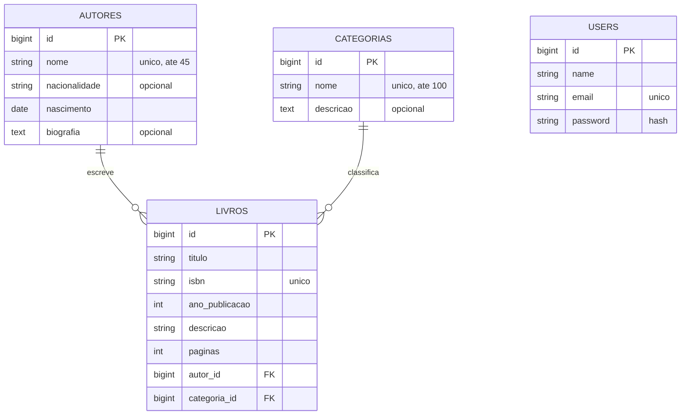

# Biblioteca API

API REST desenvolvida em **Laravel** para a disciplina de **Desenvolvimento Web III** (IF Sudeste MG, Campus Muriaé).

**Aluno:** Francisco Graveli

O sistema gerencia o acervo de uma biblioteca: **livros**, **autores** e **categorias**, além dos **usuários** que podem alterar esse acervo. A autenticação é feita por token, com **Laravel Sanctum**.

## Sumário

1. [Objetivo do projeto](#1-objetivo-do-projeto)
2. [Tecnologias](#2-tecnologias)
3. [Modelagem do banco de dados](#3-modelagem-do-banco-de-dados)
4. [Arquitetura do projeto](#4-arquitetura-do-projeto)
5. [Regras de negócio](#5-regras-de-negócio)
6. [Como rodar o projeto](#6-como-rodar-o-projeto)
7. [Autenticação](#7-autenticação)
8. [Endpoints](#8-endpoints)
9. [Paginação](#9-paginação)
10. [Exemplos de requisições](#10-exemplos-de-requisições)
11. [Códigos de resposta](#11-códigos-de-resposta)
12. [Testes](#12-testes)
13. [Postman](#13-postman)
14. [Limitações e melhorias futuras](#14-limitações-e-melhorias-futuras)

---

## 1. Objetivo do projeto

Construir uma API com um CRUD completo (criar, listar, consultar, atualizar e excluir) aplicando conceitos vistos na disciplina:

- rotas e controllers REST;
- banco de dados relacional com migrations, seeders e relacionamentos;
- validação dos dados de entrada;
- autenticação por token;
- organização do código em camadas;
- testes automatizados.

## 2. Tecnologias

| Tecnologia | Para que serve no projeto |
|---|---|
| PHP 8.3+ | Linguagem do backend |
| Laravel 13 | Framework da aplicação |
| MySQL / MariaDB | Banco de dados |
| Laravel Sanctum | Autenticação por token |
| `jason-guru/laravel-make-repository` | Base para a camada de repositórios |
| PHPUnit | Testes automatizados |
| Postman | Testes manuais da API |

## 3. Modelagem do banco de dados



**Relacionamentos:**

- Um **autor** tem vários **livros** e cada livro pertence a um autor (1 para N).
- Uma **categoria** tem vários **livros** e cada livro pertence a uma categoria (1 para N).
- A tabela `users` não se relaciona com as outras. Ela só controla quem pode usar a API. Os tokens ficam na tabela `personal_access_tokens`, criada pelo Sanctum.

As chaves estrangeiras são criadas no próprio banco (nas *migrations*), então a integridade dos dados é garantida mesmo fora da API.

## 4. Arquitetura do projeto

O código é dividido em **camadas**. Cada uma tem uma responsabilidade só, o que deixa o projeto mais organizado e mais fácil de manter e testar, montei dessa forma também para treinar conceitos além do MVC.

```
Requisição
   │
   ▼
Rota (routes/api.php)  ──► Middleware auth:sanctum (nas rotas protegidas)
   │
   ▼
FormRequest   valida os dados de entrada
   │
   ▼
Controller    recebe a requisição e devolve a resposta
   │
   ▼
Service       aplica as regras de negócio
   │
   ▼
Repository    conversa com o banco de dados
   │
   ▼
Model         representa a tabela (Eloquent)
   │
   ▼
Resource      define o formato do JSON de saída
```

### O que cada camada faz

| Camada | Pasta | Responsabilidade |
|---|---|---|
| **Rotas** | `routes/api.php` | Define as URLs e quais exigem token |
| **Form Requests** | `app/Http/Requests` | Valida a entrada antes de chegar ao controller. Se falhar, já responde `422` |
| **Controllers** | `app/Http/Controllers` | Camada "fina": só recebe a requisição, chama o service e retorna a resposta |
| **Services** | `app/Services` | Regras de negócio, como "não excluir autor que tem livros" |
| **Repositories** | `app/Repositories` | Consultas ao banco (listar, criar, atualizar, excluir) |
| **Interfaces** | `app/Repositories/Contracts` | Contrato que cada repository precisa cumprir (explicado abaixo) |
| **Models** | `app/Models` | Representam as tabelas e definem os relacionamentos |
| **Resources** | `app/Http/Resources` | Escolhem quais campos aparecem no JSON (ex.: a senha nunca sai) |
| **Policies** | `app/Policies` | Regras de permissão (usuário só altera a própria conta) |
| **Exceptions** | `app/Exceptions` | Erro próprio para "registro vinculado", que vira resposta `409` |
| **Migrations** | `database/migrations` | Criam as tabelas do banco |
| **Factories** | `database/factories` | Geram dados falsos para os testes |
| **Seeders** | `database/seeders` | Populam o banco com dados de exemplo |

### Por que usar Repository e Interface?

O **service** não acessa o banco diretamente: ele pede ao **repository**. E o service conhece apenas a **interface** do repository (`AutorRepositoryInterface`), não a classe concreta (`AutorRepository`).

Isso traz duas vantagens:

- **Baixo acoplamento:** se um dia o acesso aos dados mudar, o service continua igual, porque depende só do contrato.
- **Facilidade de teste:** dá para trocar o repository real por um falso ao testar o service.

O Laravel liga cada interface à sua classe automaticamente: o pacote `laravel-make-repository` faz isso pelo nome (`XRepositoryInterface` → `XRepository`).

### Por que usar Factory?

A *factory* cria registros **falsos, porém válidos**, para os testes. Em vez de preencher todos os campos de um livro na mão, basta escrever:

```php
$livro = Livro::factory()->create();
```

A `LivroFactory` cria sozinha o autor e a categoria necessários. A diferença para o *seeder* é que a factory gera dados aleatórios para **testes**, enquanto o seeder insere dados **fixos** (como "Dom Casmurro") para deixar o banco pronto para uso.

### Estrutura de pastas

```
app/
├── Exceptions/        RegistroVinculadoException
├── Http/
│   ├── Controllers/   Auth, Autor, Categoria, Livro, User
│   ├── Requests/      validação (Store/Update de cada recurso, Login, Register)
│   └── Resources/     formato do JSON
├── Models/            Autor, Categoria, Livro, User
├── Policies/          regras de permissão
├── Repositories/      acesso ao banco
│   └── Contracts/     interfaces dos repositories
└── Services/          regras de negócio
database/
├── factories/         dados falsos para testes
├── migrations/        estrutura das tabelas
└── seeders/           dados de exemplo
docs/                  collection do Postman
routes/api.php         rotas da API
tests/Feature/         testes automatizados
```

## 5. Regras de negócio

- **Excluir autor ou categoria com livros** é bloqueado e retorna `409`. O livro precisa ser removido ou mudar de autor/categoria antes.
- **Nome do autor, nome da categoria, ISBN do livro e e-mail do usuário** não podem se repetir.
- **Livro:** o ano de publicação não pode ser maior que o ano atual, o número de páginas deve ser maior que zero, e `autor_id` e `categoria_id` precisam existir.
- **Autor:** a data de nascimento precisa estar no passado.
- **Usuário** só pode alterar ou excluir a **própria conta** (retorna `403` se tentar mexer na de outro).
- Ao excluir um usuário, os tokens dele são apagados.
- Na atualização de usuário, a senha é opcional: se não for enviada, a senha atual é mantida.
- **Login com dados errados** retorna uma mensagem genérica, sem indicar se o erro foi no e-mail ou na senha.

## 6. Como rodar o projeto

**Pré-requisitos:** PHP 8.3+, Composer e MySQL (ou MariaDB) em execução.

```bash
# 1. instalar as dependências
composer install

# 2. criar o arquivo de configuração e a chave da aplicação
cp .env.example .env
php artisan key:generate
```

3. Crie um banco chamado `biblioteca_api` no MySQL e ajuste `DB_USERNAME`, `DB_PASSWORD` (e `DB_PORT`, se necessário) no arquivo `.env`.

```bash
# 4. criar as tabelas e popular com dados de exemplo
php artisan migrate --seed

# 5. iniciar o servidor
php artisan serve
```

A API fica disponível em `http://localhost:8000/api`.

O seeder cria 4 categorias, 4 autores, 5 livros e um usuário de teste:

- **e-mail:** `test@example.com`
- **senha:** `password`

## 7. Autenticação

A API usa **tokens do Laravel Sanctum**. As rotas de consulta (`GET`) de autores, categorias e livros são **públicas**. Cadastro, alteração e exclusão exigem token.

1. Faça login em `POST /api/login` (ou cadastre-se em `POST /api/register`).
2. Copie o `token` que vem na resposta.
3. Nas próximas requisições, envie o header `Authorization: Bearer {token}`.

Envie também `Accept: application/json` em todas as requisições.

O `POST /api/logout` revoga o token usado, que deixa de funcionar.

## 8. Endpoints

Todas as rotas começam com `/api`.

### Autenticação

| Método | Rota | Descrição | Exige token |
|---|---|---|---|
| POST | `/api/register` | Cadastra um usuário e retorna o token | Não |
| POST | `/api/login` | Faz login e retorna o token | Não |
| POST | `/api/logout` | Revoga o token atual | Sim |
| GET | `/api/user` | Dados do usuário logado | Sim |

### Autores

| Método | Rota | Descrição | Exige token |
|---|---|---|---|
| GET | `/api/autores` | Lista os autores | Não |
| GET | `/api/autores/{id}` | Retorna um autor com seus livros | Não |
| POST | `/api/autores` | Cadastra um autor | Sim |
| PUT | `/api/autores/{id}` | Atualiza um autor | Sim |
| DELETE | `/api/autores/{id}` | Remove um autor | Sim |

### Categorias

| Método | Rota | Descrição | Exige token |
|---|---|---|---|
| GET | `/api/categorias` | Lista as categorias | Não |
| GET | `/api/categorias/{id}` | Retorna uma categoria com seus livros | Não |
| POST | `/api/categorias` | Cadastra uma categoria | Sim |
| PUT | `/api/categorias/{id}` | Atualiza uma categoria | Sim |
| DELETE | `/api/categorias/{id}` | Remove uma categoria | Sim |

### Livros

| Método | Rota | Descrição | Exige token |
|---|---|---|---|
| GET | `/api/livros` | Lista os livros com autor e categoria | Não |
| GET | `/api/livros/{id}` | Retorna um livro com autor e categoria | Não |
| POST | `/api/livros` | Cadastra um livro | Sim |
| PUT | `/api/livros/{id}` | Atualiza um livro | Sim |
| DELETE | `/api/livros/{id}` | Remove um livro | Sim |

### Usuários

| Método | Rota | Descrição | Exige token |
|---|---|---|---|
| GET | `/api/users` | Lista os usuários | Sim |
| GET | `/api/users/{id}` | Retorna um usuário | Sim |
| PUT | `/api/users/{id}` | Atualiza a própria conta | Sim |
| DELETE | `/api/users/{id}` | Exclui a própria conta | Sim |

## 9. Paginação

As listagens (`GET /api/autores`, `/api/categorias`, `/api/livros` e `/api/users`) são **paginadas**, para não devolver todos os registros de uma vez.

| Parâmetro | Padrão | Descrição |
|---|---|---|
| `page` | 1 | Número da página |
| `per_page` | 15 | Itens por página (mínimo 1, máximo 100) |

Exemplo: `GET /api/livros?per_page=10&page=2`

A resposta traz três partes:

- `data`: os itens da página;
- `links`: endereços da primeira, última, anterior e próxima página;
- `meta`: informações como `current_page`, `last_page`, `per_page` e `total`.

## 10. Exemplos de requisições

**Login** (`POST /api/login`)

```json
{
    "email": "test@example.com",
    "password": "password"
}
```

Resposta:

```json
{
    "user": { "id": 1, "name": "Test User", "email": "test@example.com" },
    "token": "1|abc123..."
}
```

**Cadastro de usuário** (`POST /api/register`)

```json
{
    "name": "Maria",
    "email": "maria@exemplo.com",
    "password": "12345678",
    "password_confirmation": "12345678"
}
```

**Autor** (`POST /api/autores`)

```json
{
    "nome": "Machado de Assis",
    "nacionalidade": "Brasileira",
    "nascimento": "1839-06-21",
    "biografia": "Escritor brasileiro."
}
```

**Categoria** (`POST /api/categorias`)

```json
{
    "nome": "Romance",
    "descricao": "Obras de ficção em prosa"
}
```

**Livro** (`POST /api/livros`)

```json
{
    "titulo": "Dom Casmurro",
    "isbn": "9788535910681",
    "ano_publicacao": 1899,
    "descricao": "A história de Bentinho e Capitu.",
    "paginas": 256,
    "autor_id": 1,
    "categoria_id": 1
}
```

**Exemplo com curl**

```bash
curl -X POST http://localhost:8000/api/categorias \
  -H "Accept: application/json" \
  -H "Content-Type: application/json" \
  -H "Authorization: Bearer SEU_TOKEN" \
  -d '{"nome": "Poesia", "descricao": "Livros de poemas"}'
```

## 11. Códigos de resposta

| Código | Quando acontece |
|---|---|
| 200 | Sucesso |
| 201 | Registro criado |
| 401 | Não autenticado (sem token ou token inválido) |
| 403 | Sem permissão (ex.: alterar a conta de outro usuário) |
| 404 | Registro não encontrado |
| 409 | Não é possível excluir (autor ou categoria com livros vinculados) |
| 422 | Erro de validação (o JSON traz quais campos estão errados) |

## 12. Testes

Os testes automatizados ficam em `tests/Feature` e cobrem autenticação, autores, categorias, livros e usuários: sucesso, validações, acesso sem token, permissões e paginação.

Eles usam **SQLite em memória**, então não mexem no banco MySQL nem precisam dele:

```bash
php artisan test
```

Além dos testes automatizados, o fluxo completo (cadastro, login, CRUD de todos os recursos, permissões e logout) foi conferido manualmente contra o MySQL/MariaDB real.

## 13. Postman

A collection com todas as rotas está em `docs/biblioteca-api.postman_collection.json`. Basta importá-la no Postman. O login salva o token automaticamente na variável `token`.
